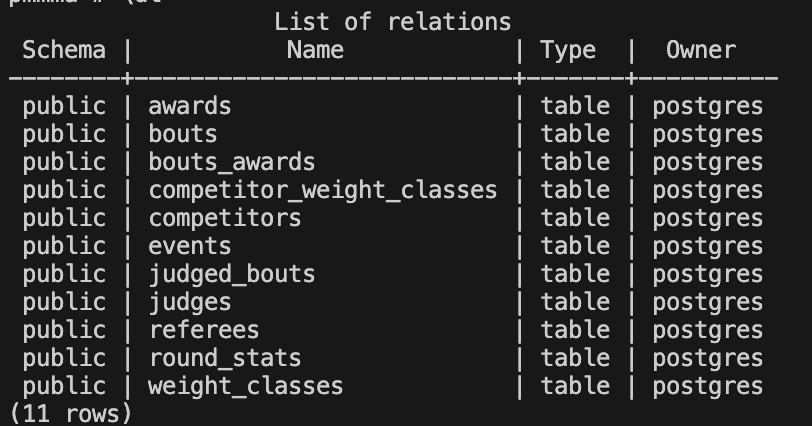
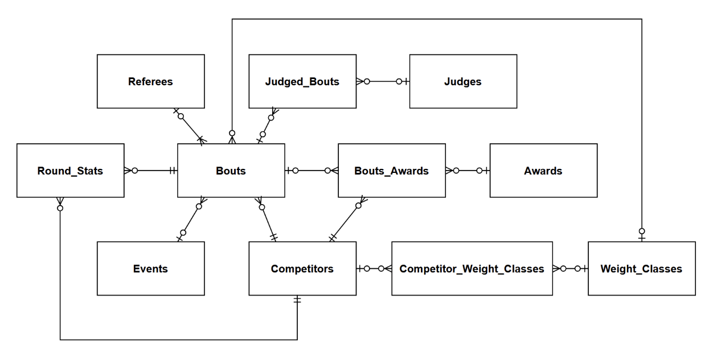
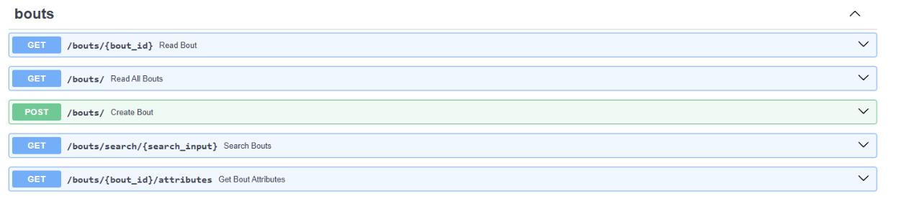
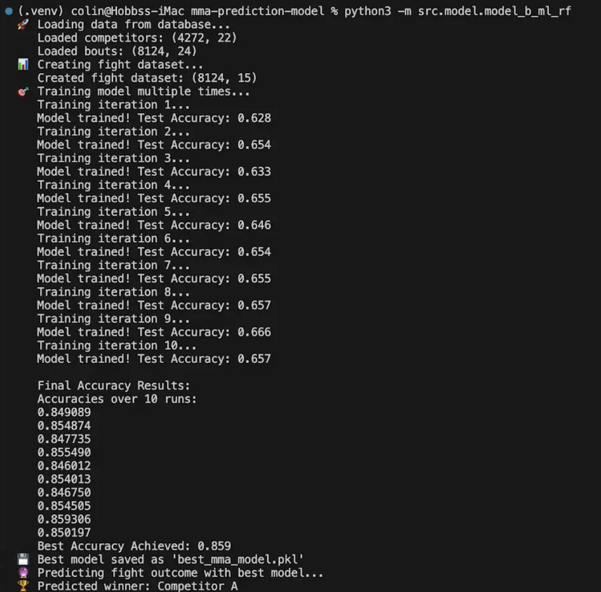

👋 Hi, I'm Colin Hobbs!
📍 Winston, OR | 📧 colin15318068@gmail.com | 📞 (503) 858-7043

🧠 Summary 

I’m a driven Computer Science student with a passion for problem-solving, system design, and software development. With hands-on experience in IT support, pharmacy operations, and academic mentoring, I bring a unique blend of technical expertise and real-world communication skills. My background in troubleshooting complex systems, both software and hardware, fuels my goal of building innovative, high-impact solutions.

👨‍💻 Software Development Projects 

🧠 [Capstone Project: MMA Prediction Model](https://github.com/vbabatchev/mma-prediction-model/) 
Our team is developing a data-driven model to predict outcomes in Mixed Martial Arts (MMA) competitions. 
Goal: Improve fight outcome predictions using machine learning and statistical analysis.

Key Features: 

✅ Web scraping of historical UFC stats 

✅ Data cleaning and preprocessing 

✅ PostgreSQL database integration 
   
   

✅ RESTful API endpoints for prediction services 
    

✅ Predictive models using rule-based logic and machine learning 
    

👨‍💻 Projects & Interests 
I'm currently expanding my skills in:

🔧 Software Development & System Architecture

💡 Data Analysis & Algorithm Design

🎮 Computer Graphics & Control Systems

📊 Hardware Design & System Administration

I enjoy exploring how things work under the hood and am naturally inclined toward optimizing processes—whether it’s streamlining a database query or fixing a broken network.

🏫 Education 
Bachelor of Science in Computer Science
Oregon State University — Graduation: June 2025

Please check out my portfolio to get know about me https://cchengb.github.io/ 
